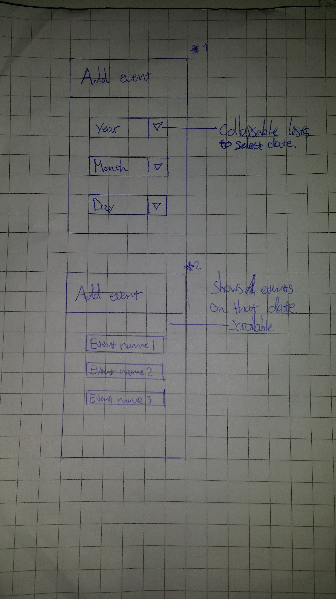

# ProgrammingProject
Joris Timmer 10636374

May 2016

##Problem
  The problem this application will solve is going to be the fact that athletes want to know how well they have performed in a certain even in comparison to others and themselves. This app will show the user how he has performed in each part of the race and show the in what top percentage the athlete has ended. The app can also save multiple races so the user can easily view its personal records. This is particularly useful for triathlons because this way the user can see that he was one of the best runners but he needs to work on his swimming. I have encountered this problem myself many times because I work at \textit{MyLaps Event Timing}. Often when the race is finished athletes come to me to ask what their time is and how he or she performed on a certain part of the event. Currently they could visit the MyLaps website, but this only shows their times often without any additional information (like their average speed in km/h on each part). This app will give the athletes insight on their races, compare their races and keep track of their personal records.
##Features
 The main features of this app will be the ability to show and save results taken from the Mylaps website. The user can search for events using the app and select his or her own time from that event. The event and the users time is then saved so it can be viewed later. This application will also automatically recognize personal records and save those in a seperate menu. The app will also use the data of all the athletes in the race to show the user how well he performed compared to others on the different parts of the race. This way the user can for instance easily see he was the fastest runner but he was an average biker and a slow swimmer. 
##Sketch

##Data
  All the data needed for this application can be found on \textit{www.mylaps.nl}. To extract the data jsoup will be used on the html files.
#Parts
  The seperate parts will consist of: 
  
  -   A main menu to navigate to events or personal records
  -   A way to add events by selecting the right race and personal time taken from the website.
  -   A personal records page consisting of links to the event pages of all personal records
  -   A event page consisting of total time, times of different parts, average speeds , ending position, positions after each part and percentile of each part.
  -   A structure of event types and events which hold all the information
  -   Optionally a  way to compare a users race with another race to see how each part compares.
    
##Problems
Not every column name is labeled the same on the website. This could cause problems when trying to extract the correct info from the html files. For instance at one race the swim time is called \textit{'Swim'} and at another it is called \textit{'Time1'}.
\section{Similar applications}
There are some MyLaps apps available already but they are mostly focussed on motorized races. These apps do not make use of the same result server as they do not contain nearly as much data as the website does. The speedhive app is a similar app which can review a users personal time. It shows not only the full time but also laptimes and can generate a graph to visiualize it.
##Minimum viable product
The MVP would be a working application that can extract race data from the mylaps website.It is able to view and the data to the user in a  convenient way and save the right data for later use. The app can automatically recognize records and view those in a separate part of the app. When reviewing the results of an event, the user can see how well he or she performed on each part compared to all other athletes. Optionally, the user can also see how it compares to the times of athletes in the same category (age/sex/etc). Another optional function could be to compare the results of one race with those of another. This way the user can easily see which parts of the race went better or worse than those parts of some other race.
